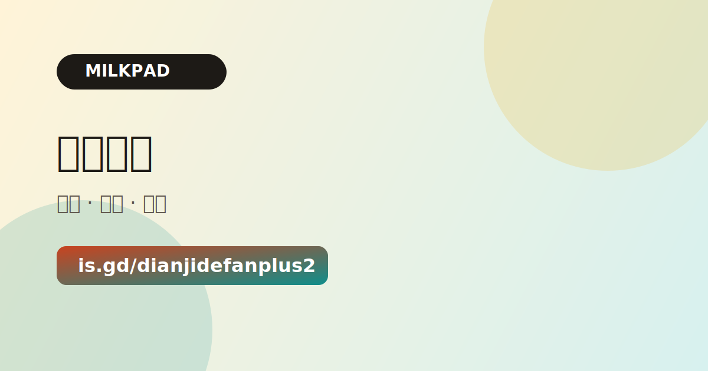
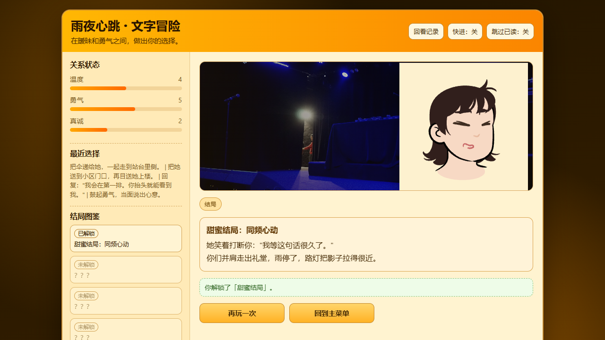

# Rainy Heartbeat Creative Web Lab

This repository is no longer just a single text adventure.
It is a small creative web lab that currently bundles a content hub, an interactive fiction game, and two Qwen3-TTS demos in one workspace.

## What Is In This Repo

| Project | Directory | Type | Stack | Best use |
| --- | --- | --- | --- | --- |
| Content hub | `content_hub_site/` | Personal site / showcase | HTML, CSS, JS | Publish ideas, web experiments, and games in one branded site |
| Rainy Heartbeat | `text_adventure_love/` | Interactive fiction game | HTML, CSS, JS modules | Branching story, save system, endings, keyboard controls |
| Qwen3 direct demo | `qwen3_tts_direct_web/` | Single-file API demo | HTML, inline CSS/JS | Fast product validation and one-page testing |
| Qwen3 clone demo | `qwen3_tts_clone_web/` | Tool-style web app | FastAPI, HTML, CSS, JS | Safer voice-clone prototype with backend proxy |

## Project Previews

### Content hub



### Rainy Heartbeat



## Repo Structure

```text
E:\Windows\Codex
|-- content_hub_site/
|-- qwen3_tts_clone_web/
|-- qwen3_tts_direct_web/
|-- text_adventure_love/
|-- docs/
|   `-- screenshots/
`-- render.yaml
```

## Local Run

### Static projects

These projects can be opened directly in a browser for quick inspection:

- `content_hub_site/index.html`
- `qwen3_tts_direct_web/index.html`

For a more reliable preview, especially when a page fetches local JSON, run a static server from the repo root:

```powershell
cd E:\Windows\Codex
python -m http.server 4173
```

Then open:

- `http://127.0.0.1:4173/content_hub_site/index.html`
- `http://127.0.0.1:4173/text_adventure_love/index.html`
- `http://127.0.0.1:4173/qwen3_tts_direct_web/index.html`

### FastAPI project

```powershell
cd E:\Windows\Codex\qwen3_tts_clone_web
python -m venv .venv
.venv\Scripts\Activate.ps1
pip install -r requirements.txt
uvicorn app.main:app --reload
```

Open `http://127.0.0.1:8000` after the server starts.

## Deployment Notes

- The current [`render.yaml`](render.yaml) publishes `text_adventure_love/` as a static site.
- If you want this repository to read clearly on GitHub, treat it as a multi-project lab, not a single-game repo.
- If any subproject starts growing independently, split it into its own repository and give it its own README, domain, and deployment config.

## Recommended GitHub Positioning

Use this repository as your "creative web lab" entry, then pin the stronger standalone projects separately.

- Best repo description: `Creative web lab with a content hub, an interactive fiction game, and Qwen3-TTS web demos.`
- Suggested topics: `creative-coding`, `interactive-fiction`, `web-experiments`, `html`, `css`, `javascript`, `fastapi`

More copy-ready metadata lives in [`docs/repo-metadata.md`](docs/repo-metadata.md).

